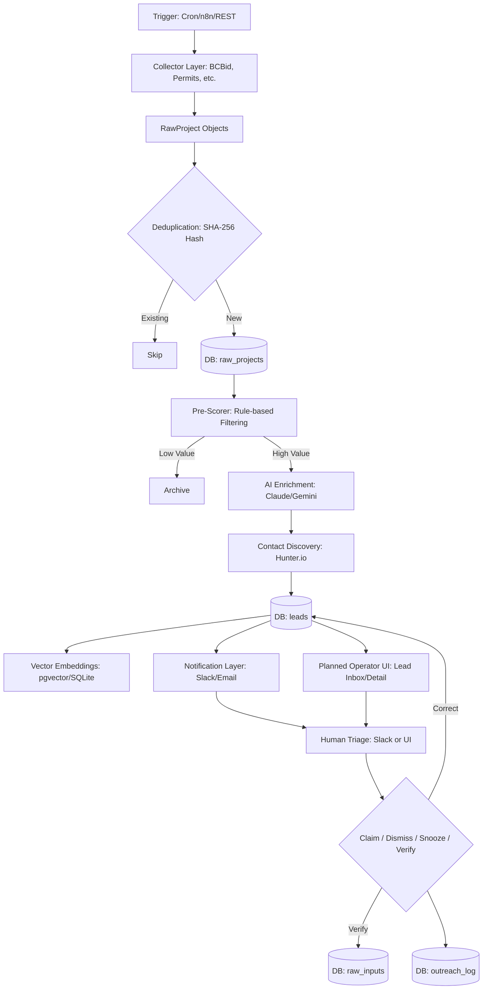
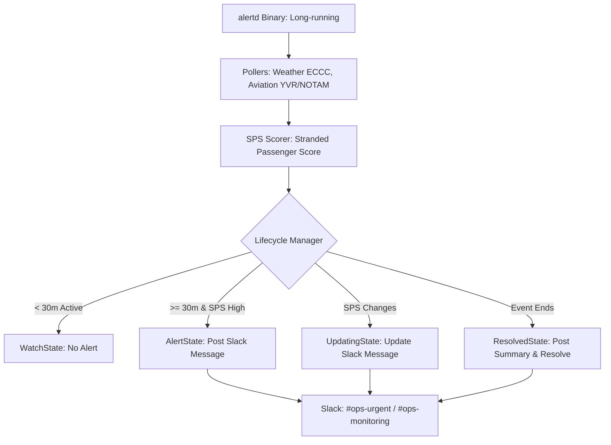

### End-to-End Data Flow

This document details the data lifecycle for the two primary systems within GroupScout: the **Leads Pipeline** and the **Disruption Alert System (alertd)**.

---

### 1. Leads Pipeline: From Source to Outreach

The leads pipeline is a multi-stage process designed to identify high-value construction and business opportunities, enrich them with AI, and notify the relevant stakeholders.

#### Architecture Diagram

#### Detailed Stages
1.  **Ingestion & Collection**: The pipeline can be triggered by internal timers, external webhooks (n8n), or manual API calls to `/run`. Collectors (BC Bid, Permit Portals, Eventbrite, etc.) fetch raw data from their respective sources.
2.  **Normalization**: Diverse data sources are converted into a standardized `RawProject` struct, ensuring consistency for downstream processing.
3.  **Deduplication**: A SHA-256 hash of the raw payload is checked against the `raw_projects` table. If the project has been seen before, it is skipped to save on processing costs.
4.  **Cost-Effective Pre-Scoring**: Before calling expensive AI APIs, a rule-based "Pre-Scorer" filters out low-value items (e.g., residential bathroom renovations or projects with budgets below a specific threshold).
5.  **AI Enrichment**: High-value projects are sent to an LLM (Claude, Gemini, or OpenAI). The AI extracts structured data such as project type, estimated crew size, duration, and a priority score.
6.  **Contact Discovery**: The system uses Hunter.io to find decision-maker contacts for the organization identified by the AI.
7.  **Persistence**: Enriched `Lead` objects are saved to the `leads` table. Vector embeddings are generated and stored in `lead_embeddings` to enable similarity-based search (RAG).
8.  **Notification & Action**: 
    -   **Real-time**: High-priority leads are sent immediately to Slack.
    -   **Digest**: Lower-priority leads are aggregated into a daily or weekly email summary via Resend.
    -   **Interaction**: Users can interact with leads (e.g., Claim/Dismiss) directly from Slack, which updates the lead status and logs the interaction in `outreach_log`.
9.  **Planned Operator Review Loop**:
    -   **Lead inbox**: The future UI should expose sortable/filterable lead triage backed by UI-specific `/api/*` endpoints.
    -   **Evidence review**: Operators should be able to open the raw audit payload for uncertain leads, starting with the implemented `GET /leads/{id}/raw` endpoint and later an authenticated UI alias.
    -   **Outcome capture**: Claim, dismiss, snooze, contacted, won, lost, and no-response actions should update lead state and `outreach_log`, creating the analytics base for source hit rate and demand forecasting.
    -   **Corrections**: Reviewer corrections should preserve the original AI extraction plus the corrected value for auditability.

---

### 2. Disruption Alert System (alertd)

The `alertd` binary is a long-running daemon that monitors external conditions (weather and aviation) to predict hotel room demand surges.

#### Architecture Diagram

#### Detailed Stages
1.  **Continuous Polling**: `alertd` polls the ECCC weather API, YVR cancellation feeds, and NavCanada NOTAMs every 5–15 minutes.
2.  **Stranded Passenger Score (SPS)**: The system computes an SPS based on:
    -   Number of cancelled flights.
    -   Average seats per aircraft.
    -   Time of day (evening cancellations drive more hotel demand).
    -   Duration of the disruption (e.g., fog vs. multi-day snow).
3.  **Stateful Lifecycle Management**: To prevent alert fatigue, the `LifecycleManager` handles the state of each disruption:
    -   **Watch**: Initial detection. If the event resolves in < 30 mins, no alert is sent.
    -   **Alert**: The first Slack message is posted once thresholds are met.
    -   **Updating**: As the SPS changes (e.g., more cancellations), the *original* Slack message is updated via `chat.update` to keep the channel clean.
    -   **Resolved**: When the event ends, a final resolution summary is posted, including total duration and final impact.
4.  **Channel Routing**:
    -   **HardAlerts** (High SPS): Routed to `#ops-urgent` for immediate hotel staffing adjustments.
    -   **SoftAlerts/Watch** (Low SPS): Routed to `#ops-monitoring` for situational awareness.
